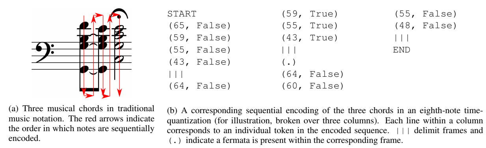

# Deep Learning for Music Generation
I love music and deep learning. Let's combine both.

---
**List of experiments**
1. [Overfitting example](01_Overfitting_Simple_Song.ipynb): Overfit a single and simple piece of music with a basic encoder-decoder LSTM

**Todo**
- [ ] Support Ties
- [ ] Support chords
- [ ] Use attention
- [x] ~~Perform quantization~~
- [ ] Look for more advanced network architectures (RNN's, GAN's...)

## Encoding details
Encoding is inspired by [Bachbot](https://github.com/feynmanliang/bachbot). Image is from [here](https://www.microsoft.com/en-us/research/wp-content/uploads/2017/11/156_Paper.pdf): 

All 128 MIDI-Notes are supported. Additionally we use 3 unique symbols: start, stop, ~~EOF (end of frame)~~, Tied. Therefore notes are encoded in a 131-dimensional vector.

* Alle notes should be quantised to a minimum pre-defined length (shortest supported note)
* network gets an 3 dimensional vector as input. The shape is (batchsize, timesteps, 132). The 132 elements of the vector are binary (0 or 1). Since a chord contains multiple notes in one timestep it's not a one-hot encoding
* The network can handly arbitrarily long input sequences (number of timesteps can vary)

&nbsp;
---
**Some interesting and relevant links**
* **http://www.mlsalt.eng.cam.ac.uk/foswiki/pub/Main/ClassOf2016/Feynman_Liang_8224771_assignsubmission_file_LiangFeynmanThesis.pdf**
* https://medium.com/artists-and-machine-intelligence/neural-nets-for-generating-music-f46dffac21c0
* https://www.microsoft.com/en-us/research/wp-content/uploads/2017/11/156_Paper.pdf
* https://staff.fnwi.uva.nl/b.bredeweg/pdf/BSc/20152016/Vranken.pdf
* https://www.ini.rub.de/upload/file/1521461530_7126db755dc03bec85b1/dada-bsc.pdf